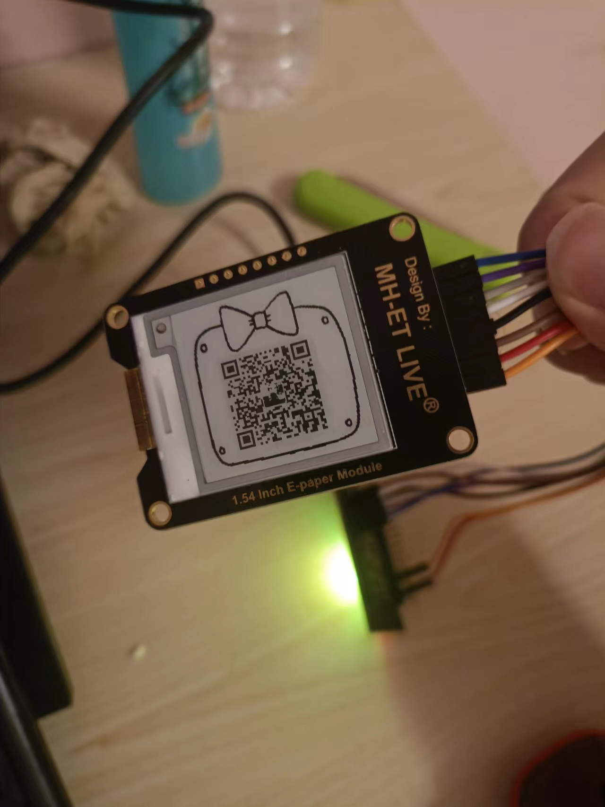
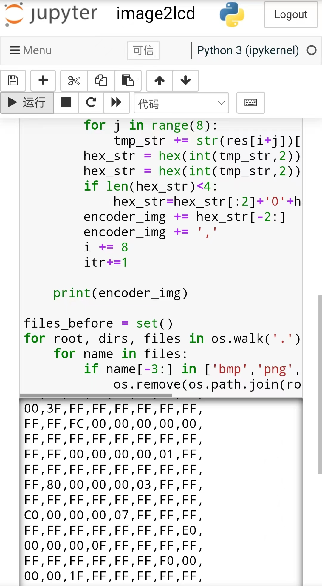
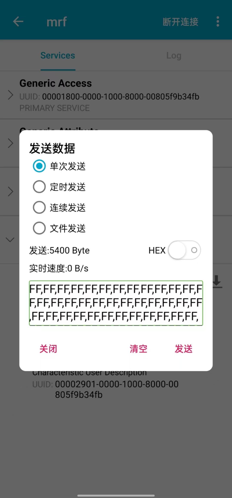

# epaper_ble

This system can realize the function of sending pictures from mobile phones to display on epaper.



## Hardware

* BLE/Arduino:  HW-867  BLE-NANO, Bluetooth transparent transmission and Arduino functions with small size (【淘宝】https://m.tb.cn/h.UbusHO7?tk=RZzB2vR3OeD CZ3457 「适用于Arduino Nano升级版/集成CC2540 BLE蓝牙4.0/Ble-Nano主板」)

* epaper: MH-ET LIVE,1.54 inch, Pixel 200x200 (【淘宝】https://m.tb.cn/h.U004xJN?tk=KRJU2vR4FCq CZ3457 「1.54寸墨水屏模块 E-paper电子纸显示屏 兼容Arduino STM32」)

  

  | 1.54 e-Paper | UNO /NANO V3.0/ PRO MINI /MEGA2560 |
  | ------------ | ---------------------------------- |
  | 5.0V         | 5.0V                               |
  | GND          | GND                                |
  | DIN          | D11                                |
  | CLK          | D13                                |
  | CS           | D10                                |
  | DC           | D9                                 |
  | RST          | D8                                 |
  | BUSY         | D7                                 |

  

## Workflow

* Use jupyter notebook to transcode images into hexadecimal codes.

* Send hexadecimal codes with serial port by BLE Tools. (https://cloud.tencent.com/developer/article/1896977) 

* display image on epaper.

  

## jupyter notebook

### Deploy jupyter server on ubuntu

https://zhuanlan.zhihu.com/p/44405596

https://blog.csdn.net/qq_34419607/article/details/109177125

```shell
# 安装环境
pip3 install -i https://pypi.tuna.tsinghua.edu.cn/simple jupyter
pip3 install -i https://pypi.tuna.tsinghua.edu.cn/simple opencv-python

# 生成配置文件jupyter_notebook_config.py
jupyter notebook --generate-config


# 输入 ipython，进入交互python环境
>>>from notebook.auth import passwd
>>>passwd
Enter passwd:				# 这里输入你的密码
Verify passwd:				#重复输入密码
>>>argon2:$argon2id$v=19$m=10240,t=10,p=8$YiTF3tI7ZWECTbNaa5VZtA$kaU+xbQSsMaZsH98sqoaGg  #复制这段秘钥

# 修改配置文件

vim ~/.jupyter/jupyter_notebook_config.py
 
 
 
#其中为了快速搜索定位，你会用到下列命令
#/c.NotebookApp.ip # 回车
#/c.NotebookApp.open_brower #回车
#/c.NotebookApp.port #回车
#/c.NotebookApp.allow_remote_access #回车

# 找到如下几项，取消注释并修改：

c.NotebookApp.password ='argon2:$argon2id$v=19$m=10240,t=10,p=8$YiTF3tI7ZWECTbNaa5VZtA$kaU+xbQSsMaZsH98sqoaGg' #秘钥
c.NotebookApp.ip='*' # *允许任何ip访问
c.NotebookApp.open_browser = False # 默认不打开浏览器
c.NotebookApp.port =8888 # 可自行指定一个端口, 访问时使用该端口
c.NotebookApp.allow_remote_access = True

c.NotebookApp.ip = '*' #所有绑定服务器的IP都能访问，若想只在特定ip访问，输入ip地址即可
c.NotebookApp.port = 6666 #将端口设置为自己喜欢的吧，默认是8888
c.NotebookApp.open_browser = False #我们并不想在服务器上直接打开Jupyter Notebook，所以设置成False
c.NotebookApp.notebook_dir = '/root/jupyter_projects' #这里是设置Jupyter的根目录，若不设置将默认root的根目录，不安全
c.NotebookApp.allow_root = True # 为了安全，Jupyter默认不允许以root权限启动jupyter 

# 启动服务器

jupyter notebook
```

### transcode images into hexadecimal codes

```python
import os
import cv2
import numpy as np

files_before = []
for root, dirs, files in os.walk('.'):
    for name in files:
        if name[-3:] in ['bmp','png','jpg'] or name[-4:] in ['jpeg']:
            files_before.append(os.path.join(root, name))
if len(files_before)!=1:
    print("请重新上传照片，并再次运行程序")
else:
    img = cv2.imread(files_before[0],cv2.IMREAD_GRAYSCALE)
    img = cv2.resize(img, (120, 120))
    res = np.zeros(shape=(120,120))
    lens = img.shape[0]*img.shape[1]
    for i in range(img.shape[0]):
        for j in range(img.shape[1]):
            tmp = int(img[i,j]/255+0.5)
            res[j,i] = round(tmp,1)
    res = res.reshape(-1)
    i=0
    itr =0
    encoder_img = ''
    while i < lens:
        tmp_str = ''
        for j in range(8):#Every 8 pixels form a byte
            tmp_str += str(res[i+j])[:1]
        hex_str = hex(int(tmp_str,2))
        hex_str = hex(int(tmp_str,2)).swapcase()
        if len(hex_str)<4:
            hex_str=hex_str[:2]+'0'+hex_str[-1]
        encoder_img += hex_str[-2:]
        encoder_img += ','
        i += 8
        itr+=1

    print(encoder_img)
    
files_before = set()
for root, dirs, files in os.walk('.'):
    for name in files:
        if name[-3:] in ['bmp','png','jpg'] or name[-4:] in ['jpeg']:
            os.remove(os.path.join(root, name))
```

And then, copy the output of a cell to the clipboard



I also deploy notebook in `mercury/img2lcd` as a web app. The deply guide is on https://zhuanlan.zhihu.com/p/561248459

## epaper

Image encoding principle: binarize eight consecutive pixels, and write the binarized 0, 1 string into a hexadecimal byte.

```c
unsigned char gcs[1800];
int num = 0;
char tmp[3];
char value[2];

void loop() {
      if (Serial.available())
      {
         // read 3 bytes
         Serial.readBytes(tmp,3); 
         for( int i = 0; i < 2; i++ )
         {  
            // ASCII to int:convert A~F
            value[i] = tmp[i]-65+10;
            if (value[i]<10){
              // ASCII to int:convert 0~9
              value[i] = tmp[i]-48;
         }
      
         }
         gcs[num] = value[0]*16+value[1];
         num++; 
      }
    
      if (num==1800){
                  
          EPD_Dis_MEM(65,160,gcs,120,120); //x,y,DATA,resolution 112*112
          delay(100);
          num=0;
      }
}


void EPD_Dis_MEM(unsigned int x_start,unsigned int y_start,const unsigned char * datas,unsigned int PART_COLUMN,unsigned int PART_LINE)
{
  unsigned int i;  
  unsigned int x_end,y_start1,y_start2,y_end1,y_end2;
  x_start=x_start/8;//
  x_end=x_start+PART_LINE/8-1; 
  
  y_start1=0;
  y_start2=y_start;
  if(y_start>=256)
  {
    y_start1=y_start2/256;
    y_start2=y_start2%256;
  }
  y_end1=0;
  y_end2=y_start+PART_COLUMN-1;
  if(y_end2>=256)
  {
    y_end1=y_end2/256;
    y_end2=y_end2%256;    
  }   
  
  Epaper_Write_Command(0x44);       // set RAM x address start/end, in page 35
  Epaper_Write_Data(x_start);    // RAM x address start at 00h;
  Epaper_Write_Data(x_end);    // RAM x address end at 0fh(15+1)*8->128 
  Epaper_Write_Command(0x45);       // set RAM y address start/end, in page 35
  Epaper_Write_Data(y_start2);    // RAM y address start at 0127h;
  Epaper_Write_Data(y_start1);    // RAM y address start at 0127h;
  Epaper_Write_Data(y_end2);    // RAM y address end at 00h;
  Epaper_Write_Data(y_end1);    // 


  Epaper_Write_Command(0x4E);   // set RAM x address count to 0;
  Epaper_Write_Data(x_start); 
  Epaper_Write_Command(0x4F);   // set RAM y address count to 0X127;    
  Epaper_Write_Data(y_start2);
  Epaper_Write_Data(y_start1);
  
  
   Epaper_Write_Command(0x24);   //Write Black and White image to RAM
   for(i=0;i<PART_COLUMN*PART_LINE/8;i++)
   {                         
     Epaper_Write_Data(datas[i]);
   } 
   EPD_Part_Update();

}
```



## other technologies

* Since Nano has limited memory, we use PROGMEM to store constant pictures.

* [(44条消息) 关于arduino超内存问题的解决_蓝莓莓的博客-CSDN博客_arduino可用内存偏低,可能出现稳定性问题](https://blog.csdn.net/qq_45037925/article/details/103964861)

* [全局变量太多，动态内存不足-Arduino中文社区 - Powered by Discuz!](https://www.arduino.cn/thread-21836-1-1.html)

  
